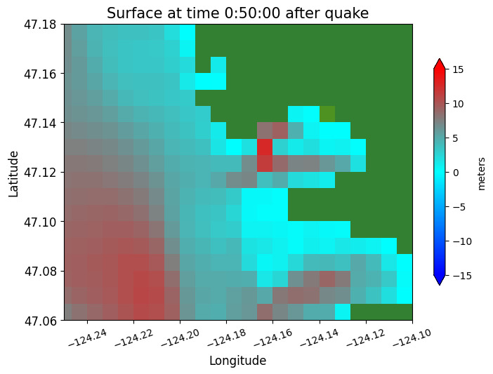
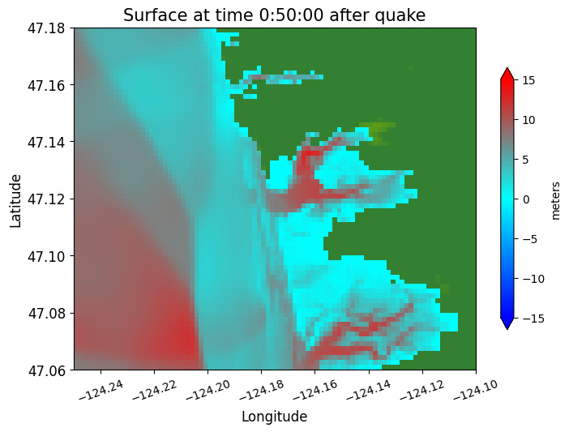
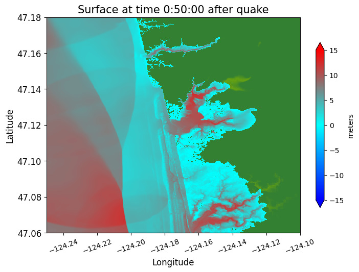
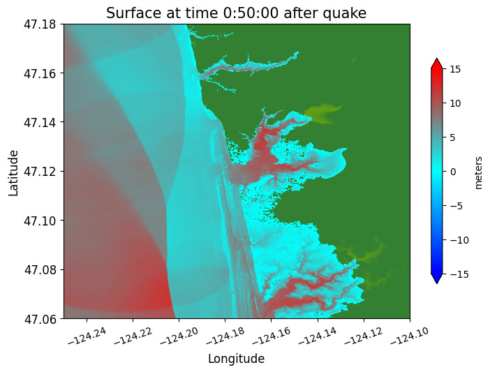

# Sample results for Copalis Beach

From the
[GeoClaw Tsunami Tutorial](https://rjleveque.github.io/geoclaw_tsunami_tutorial)

The directory `$GTT/CopalisBeach/example1`
contains some initial GeoClaw `setrun` and `setplot` functions to start
exploring tsunami modeling.

See  for more about these examples.

The `setrun` files defined in this directory are all nearly identical, but
allow a different number of refinement levels.  The coarsest (3-level) case
runs quickly and shows how things are refined in most of the domain.
The other versions add refinement levels only near Copalis Beach, and so the
full domain plots look nearly identical and are not shown in the videos below.

See  for detailed description of the `setrun1a.py`
script, and  for more discussion of the output.

## Run times

These runs were done on a Macbook Pro with the M1 chip and 6 OpenMP threads.

|example | finest-level grid resolution | elapsed wall time | Total CPU time |
|---:|---:|---:|---:|
|setrun1a |24 arcsec  (level 3)| 35 seconds | 181 seconds |
|setrun1b | 6 arcsec  (level 5)| 314 seconds | 1716 seconds |
|setrun1c | 1 arcsec  (level 7)| 465 seconds | 2602 seconds |
|setrun1d | 1/3 arcsec  (level 8)| 1780 seconds | 10275 seconds |

## Comparison of the inundation

Shown around Copalis Beach with different finest-level resolution,
at time 50 minutes.

### 24" resolution

### 6" resolution

### 1" resolution

### 1/3" resolution

## Videos

### Full domain from 3-level run 

Computed using  `setrun1a.py` with 24" resolution around Copalis

The other versions add refinement levels only near Copalis Beach, and so the
full domain plots look nearly identical and are not shown below.

Right click and select "Show all controls" to find the Play button.

### Inundation around Copalis from 3-level run

Computed using  `setrun1a.py` with 24" resolution around Copalis

Right click and select "Show all controls" to find the Play button.

### Inundation around Copalis from 5-level run

Computed using  `setrun1b.py` with 6" resolution around Copalis

Right click and select "Show all controls" to find the Play button.

### Inundation around Copalis from 7-level run

Computed using  `setrun1c.py` with 1" resolution around Copalis

Right click and select "Show all controls" to find the Play button.

### Inundation around Copalis from 8-level run

Computed using  `setrun1d.py` with 1/3" resolution around Copalis

Right click and select "Show all controls" to find the Play button.

