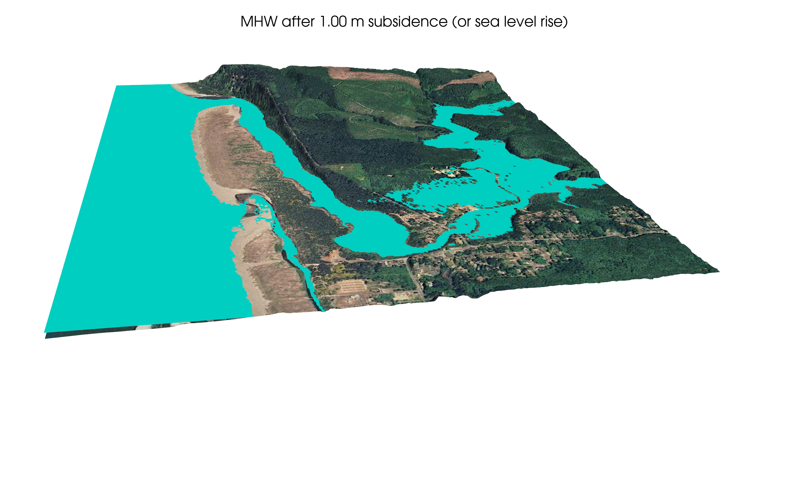
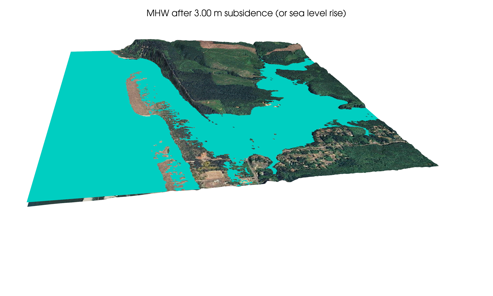

(topo:pyvista_interactive)=
# An interactive 3D plot

## Interactive plot of the Copalis Beach topography

The script `$GTT/topo/pyvista_CopalisTopo.py` was used to create a 3D view of
the Copalis Beach topography as described in .

Here is an interactive version created by setting `output = 'html'` in the
script and then embedding the resulting html file in this page:

<iframe
    width="600"
    height="600"
    src="https://depts.washington.edu/clawpack/geoclaw/GTT_html/CopalisTopo3D.html"
    frameborder="0"
    allowfullscreen>text
</iframe>

## Changing sea level / coastal subsidence

The script `pyvista_CopalisTopo_sealevel.py` can be run to open an
interactive view that allows you to change sea level, in order to explore
what this topography would look like if sea level rises (or following the
co-seismic subsidence of an earthquake).

Below are a couple of snapshots that were produced by setting
`make_snapshots = True` in the script.

The water surface at the current MHW is shown in plots above. These
snapshots show two elevated levels.

