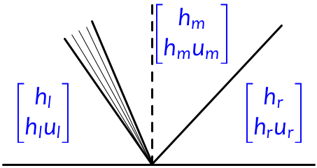

# Testing Jupyter Book features

:::{warning}
This is just a test page for trying things out and debugging the Jupyter book...
:::

:::{note}
The reason some features tested below do not work is because I am using
JupyterBook 1, which does the rendering via Sphinx.  

[JupyterBook 2](https://next.jupyterbook.org/) uses a new MyST Document
Engine and handles fancier Myst features that do not render properly here.
See [Upgrade](https://next.jupyterbook.org/upgrade/) for more information
about the differences.
:::

- ~~testing stirkethrough~~

## Why don't `wiki:` and `doi:` citations work like they should?

You should also be able to hover over references as illustrated in the
myst documentation
- [wiki](https://mystmd.org/guide/external-references#wikipedia-links)
- [doi](https://mystmd.org/guide/external-references#linking-dois)

My `_config.yml` contains

    myst_url_schemes: ["mailto", "http", "https", "wiki", "doi"]

but these don't work...

- [ghost forest](wiki:Ghost_forest) should resolve to
  https://en.wikipedia.org/wiki/Ghost_forest
- Not working: [This paper](doi:10.1029/91JB02346)  % not working
- This works but no hover: [This paper](https://doi.org/10.1029/91JB02346)

## using macros for websites?

- Testing replacement: {{ WEBSITE }} is a url?
- Testing [website]({{ WEBSITE }})
- Testing <a href="{{ WEBSITE }}">website in raw html</a>
- Testing <a href="{{ CLAWDOCS }}/fgmax.html">website in raw html</a>

## Latex

Testing with some text from the Jupyter notebook for Chapter 7 of
[Riemann Problems and Jupyter Solutions](https://www.clawpack.org/riemann_book/html/Index.html) {cite:p}`RPJS`.

Why don't the equation references work properly in this? They do in other
simple tests....

### Chapter 7: Shallow Water Waves

In this chapter we study a model for shallow water waves in one dimension:  
\begin{align}
    h_t + (hu)_x & = 0, \label{SW_mass} \\
    (hu)_t + \left(hu^2 + \frac{1}{2}gh^2\right)_x & = 0. \label{SW_mom}
\end{align}  
Here $h$ is the depth, $u$ is the velocity, and $g$ is a constant representing the force of gravity.  These equations are "depth averaged" and neglect vertical velocity and any vertical variations in the horizontal velocity.  Viscosity and compressibility are neglected, and the pressure is assumed to be hydrostatic.  Nevertheless, this is a surprisingly effective model for many applications, particularly when the wavelength is long compared to the fluid depth.

#### Hyperbolic structure
We can write (\ref{SW_mass})-(\ref{SW_mom}) in the canonical form $q_t + f(q)_x = 0$ if we define  
\begin{align}
q & = \begin{pmatrix} h \\ hu \end{pmatrix}, & f & = \begin{pmatrix} hu \\ hu^2 + \frac{1}{2}gh^2 \end{pmatrix}.
\end{align}  
In terms of the conserved quantities, the flux is  
\begin{align}
f(q) & = \begin{pmatrix} q_2 \\ q_2^2/q_1 + \frac{1}{2}g q_1^2 \end{pmatrix}.
\end{align}  
Thus the flux Jacobian is  
\begin{align}
f'(q) & = \begin{pmatrix} 0 & 1 \\ -(q_2/q_1)^2 + g q_1 & 2 q_2/q_1 \end{pmatrix}
        = \begin{pmatrix} 0 & 1 \\ -u^2 + g h & 2 u \end{pmatrix}.
\end{align}  
Its eigenvalues are  
\begin{align} \label{SW:char-speeds}
    \lambda_1 & = u - \sqrt{gh}, & \lambda_2 & = u + \sqrt{gh},
\end{align}  
with corresponding eigenvectors  
\begin{align} \label{SW:fjac-evecs}
    r_1 & = \begin{bmatrix} 1 \\ u-\sqrt{gh} \end{bmatrix} &
    r_2 & = \begin{bmatrix} 1 \\ u+\sqrt{gh} \end{bmatrix}
\end{align}  
Notice that -- unlike acoustics, but similar to the LWR traffic model -- the eigenvalues and eigenvectors depend on $q$.  Because of this, the waves appearing in the Riemann problem move at different speeds and may be either jump discontinuities (shocks) or smoothly-varying  rarefaction waves.

Equation (\ref{SW:char-speeds}).

#### The Riemann problem
Consider the Riemann problem with left and right states

\begin{align*}
q_\ell & = \begin{bmatrix} h_\ell \\ h_r u_\ell \end{bmatrix}, &
q_r & = \begin{bmatrix} h_r \\ h_r u_r \end{bmatrix}.
\end{align*}

Typically the Riemann solution consists of two waves, one related to each of the eigenvectors in (\ref{SW:fjac-evecs}).  We refer to the wave related to $r_1$ (the first characteristic family) as a 1-wave, and the wave related to $r_2$ (the second characteristic family) as a 2-wave.  Each wave may be a shock or rarefaction.  There is a constant intermediate state $q_m$ between them.  In the figure below, we illustrate a typical situation in which the 1-wave happens to be a rarefaction and the 2-wave is a shock:

In the figure we have one wave going in each direction, but since the wave speeds depend on $q$ and can have either sign, it is possible to have both waves going left, or both going right.  In these cases, the flow is said to be *supercritical*.

To solve the Riemann problem, we must find $q_m$.  To do so we must find a state that can be connected to $q_\ell$ by a 1-shock or 1-rarefaction and to $q_r$ by a 2-shock or 2-rarefaction.  We must also ensure that the resulting waves satisfy the entropy condition.

## Testing iframe

Try embedding the shallow water Riemann solution interactive widget shown
at the bottom of https://www.clawpack.org/riemann_book/

<iframe
    width="600"
    height="600"
    src="https://www.clawpack.org/riemann_book/phase_plane/shallow_water_verysmall.html"
    frameborder="0"
    allowfullscreen></iframe>
